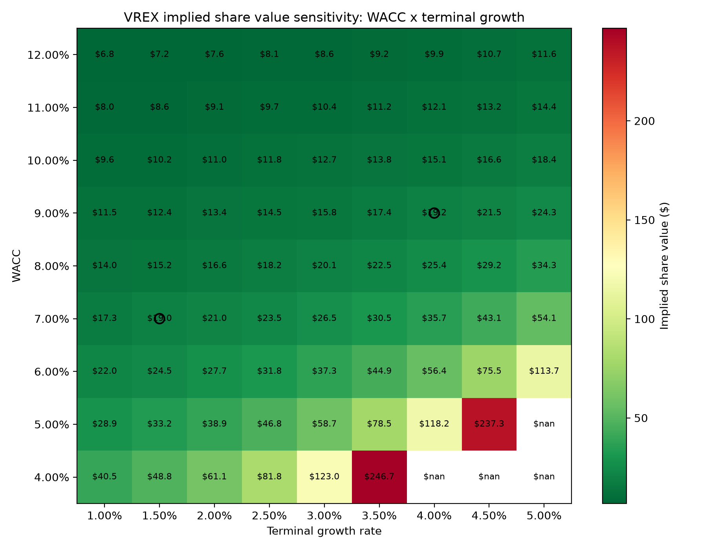
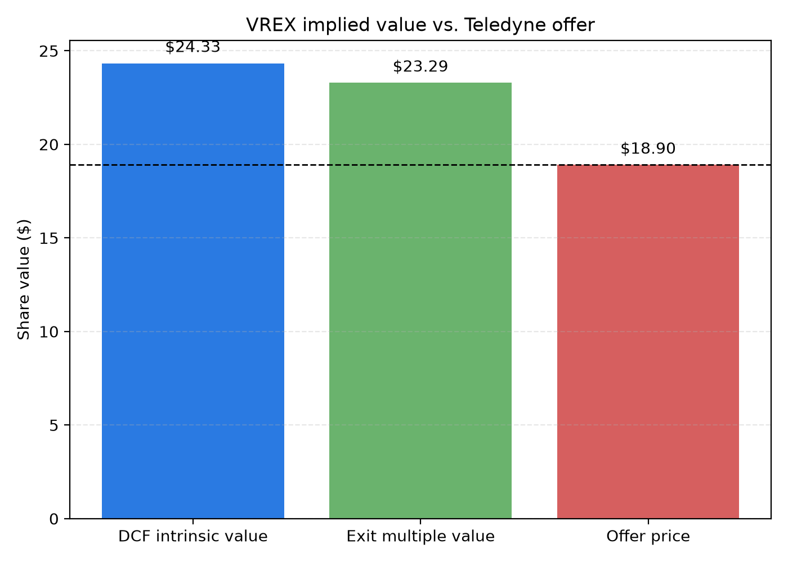

# Varex Imaging (VREX) DCF Valuation & Fairness Assessment

This project builds a clean, interview-ready DCF model to assess whether Teledyne Technologies' $18.90/share all-cash offer (announced 10 Aug 2026) for Varex Imaging is fair. The model is fully explained and commented so every financial concept—WACC, UFCF, terminal value, sensitivity—can be discussed in an interview without hesitation.

## Project structure

- `scripts/valuation_dcf.py` – main DCF model: data pull, WACC calculation, UFCF projection, terminal value, sensitivity analysis, trading comps cross-check. Every financial concept is explained in comments.
- `output/vrex_dcf_summary.csv` – key valuation metrics (WACC, cost of equity, cost of debt, implied share prices).
- `output/wacc_growth_sensitivity.png` – 2D sensitivity heatmap: implied share price for different WACC and terminal growth assumptions.
- `output/implied_value_vs_offer.png` – bar chart comparing DCF intrinsic value, exit-multiple intrinsic value, and the offer price.
- `requirements.txt` – project dependencies.

## How to run

```bash
python3 -m pip install -r requirements.txt
python3 scripts/valuation_dcf.py
```

The script saves charts and summary data in `output/`.

## Base-case results

The script was run against actual Varex financial data and market inputs as of August 2026:

- WACC: 6.87% | Beta: 0.877 | Cost of equity: 8.59%
- **DCF implied share value: ~$24.33/share**
- **Exit-multiple implied value: ~$23.29/share**
- **Teledyne offer price: $18.90/share**
- **Implied upside: ~28.7%**

The $18.90 offer is below both valuation methods by 23–29%. See sensitivity analysis below to identify which assumptions matter most.

## Valuation visualizations

### Sensitivity Heatmap: WACC × Terminal Growth



Shows implied share price for different WACC (4–12%) and perpetual growth (1–5%) combinations. Offer price marked where applicable. This demonstrates which scenarios justify deal acceptance/rejection.

### Implied Value vs. Offer Price



Compares DCF intrinsic value (two methods) vs. acquisition offer price, showing the valuation gap.

## Valuation methodology (concise overview)

### WACC (Weighted Average Cost of Capital)
- **Cost of Equity (CAPM)**: Rf + β(Rm − Rf) = 4.2% + 0.877 × 5% = 8.59%
- **Cost of Debt (after-tax)**: 5.37% × (1 − 0.35) = 3.49%
- **Capital Structure**: 66.3% equity, 33.7% debt
- **WACC**: 6.87% (discount rate for all cash flows)

### Unlevered Free Cash Flow (5-year explicit forecast)
- UFCF = NOPAT + D&A − Capex − ΔWorking Capital
- Historical EBIT margin: 7.7% | D&A margin: 2.4% | Capex margin: 2.7%
- Conservative revenue growth: ~flat (recent headwinds)

### Terminal Value (Gordon Growth Model + Exit Multiple Cross-Check)
- **Gordon Growth**: FCF_year6 / (WACC − g), where g = 2.5%
- **Exit Multiple**: Terminal EBITDA × 16.4x (median GEHC/TDY EV/EBITDA)
- Terminal value represents ~70% of enterprise value; highly sensitive to g

### Discounting & Per-Share Price
- Enterprise Value = PV(forecast period UFCF) + PV(terminal value)
- Equity Value = Enterprise Value − Net Debt
- Share Price = Equity Value / Shares Outstanding

### Trading Comps (Directional Cross-Check)
- GEHC (GE HealthCare) and TDY (Teledyne): median EV/EBITDA ~16.4x
- Caveat: No pure-play public comp; these serve as directional proxies only

### Sensitivity Analysis
2D table varies WACC (4–12%) and terminal growth (1–5%) to show valuation range and key assumption sensitivities.

## Key assumptions

| Assumption | Base Case | Rationale |
|---|---|---|
| Terminal growth | 2.5% | Below long-term GDP; reflects stable but maturing market |
| WACC | 6.87% | CAPM-based after-tax blended cost |
| Risk-free rate | 4.2% | 10Y US Treasury, Aug 2026 |
| Tax rate | 35% | Median of recent profitable years |
| Forecast period | 5 years | Standard DCF horizon |
| Revenue growth | ~0% | Conservative; cyclical weakness evident |

## Code comments & financial explanations

Every function and major calculation in `scripts/valuation_dcf.py` includes detailed comments explaining:
- WACC and CAPM (cost of equity, cost of debt, capital structure weights)
- UFCF build (NOPAT, D&A, Capex, working capital)
- Terminal value (Gordon growth formula, exit multiple approach)
- Discounting logic (present value calculation)
- Sensitivity table construction (two-way sensitivity and interpretation)

**Interview-ready**: Read the comments and code; you'll be able to explain every step without notes.

## Limitations & discussion points

1. **No pure-play comp**: GEHC/TDY are large conglomerates; directional at best
2. **Terminal value leverage**: ±0.5% change in g → ±10–15% valuation change
3. **Cyclical headwinds**: Varex's medical imaging market is tied to healthcare capex cycles
4. **Synergies not modeled**: Teledyne's acquirer synergies/integration costs not included
5. **Forward-looking risk**: Assumptions subject to market/business changes

## Interview talking points

**WACC**: "I used CAPM with Varex's actual beta (0.877) and a 5% historical risk premium. The company is two-thirds equity-financed, one-third debt. After-tax cost of debt is 3.5%; cost of equity is 8.6%, so WACC = 6.9%."

**UFCF**: "Free cash flow = operating profit after tax, add back non-cash depreciation, subtract capital reinvestment and working capital needs. Varex runs ~7.7% EBIT margins and ~2.7% capex/sales based on history."

**Terminal Value**: "I assume 2.5% perpetual growth (below long-term GDP), which gives terminal value ~$X billion. I cross-check against a 16.4x EBITDA multiple from comparable companies and get a similar number, so I'm confident in the terminal value."

**Sensitivity**: "The heatmap shows if WACC rises to 7.9%, value drops to ~$21/share. If terminal growth were 3.5%, value rises to ~$28/share. This highlights which assumptions drive the valuation."

**Deal Assessment**: "At $18.90, Teledyne is paying 28% below my base-case intrinsic value. The deal looks fair to slightly attractive from a buyer's standpoint, but not obviously cheap unless my terminal growth or WACC assumptions are off."

---

**This is a deal-note style valuation framework—not a legal fairness opinion. It demonstrates structured, transparent thinking suitable for portfolio and interview discussion.**
